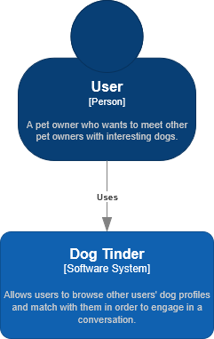
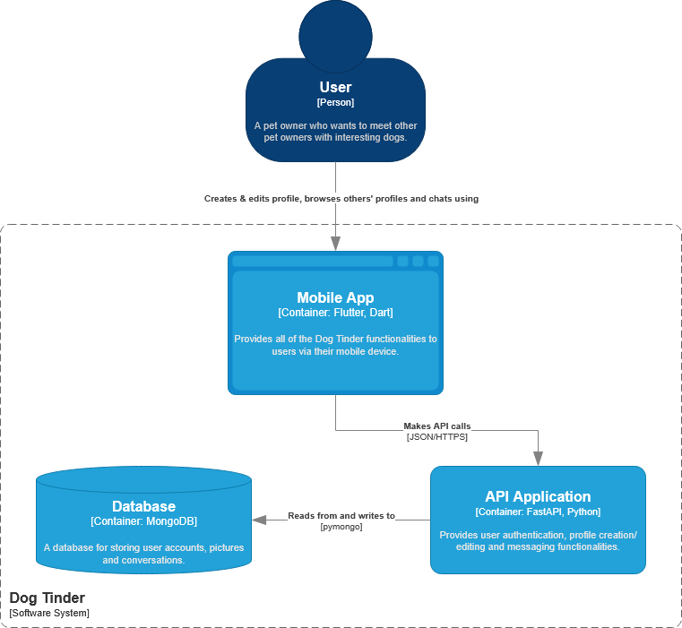
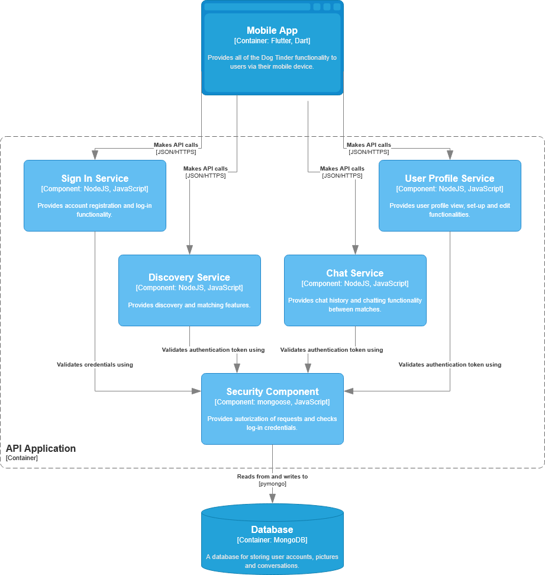
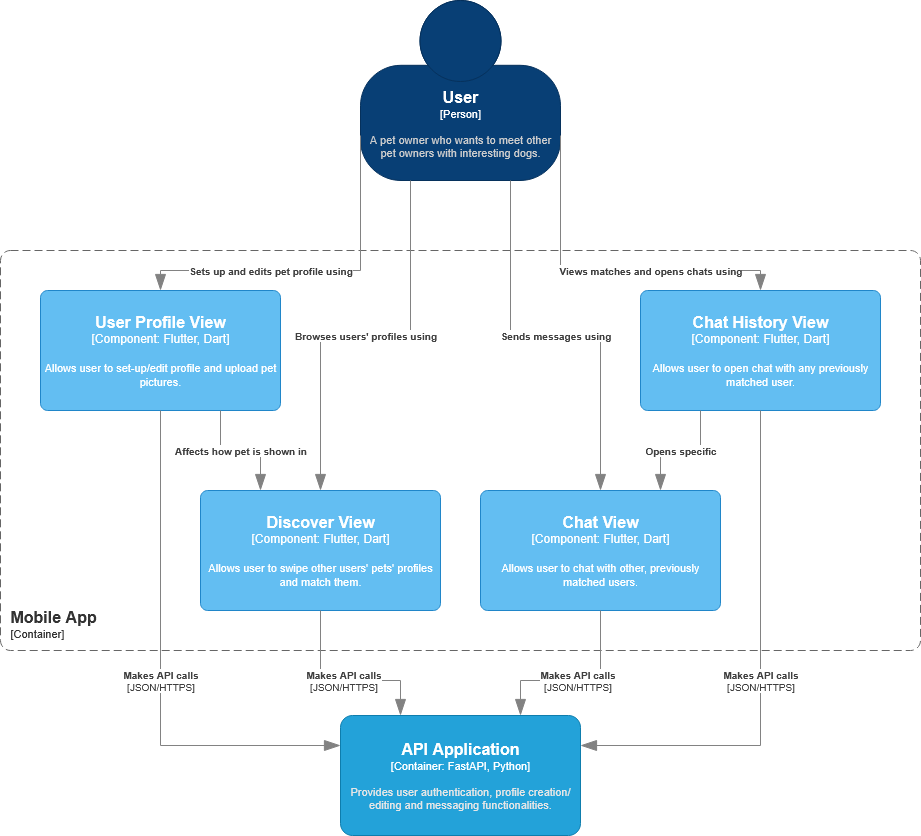
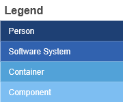
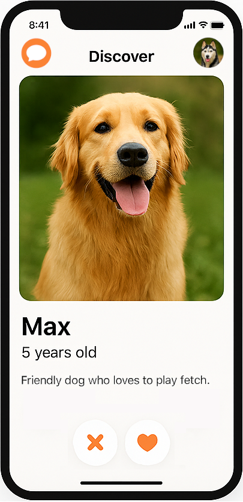
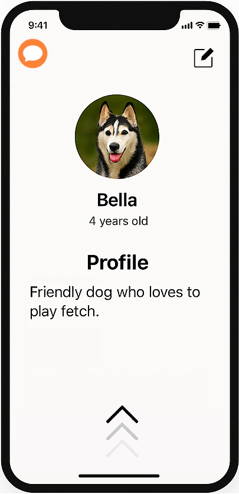
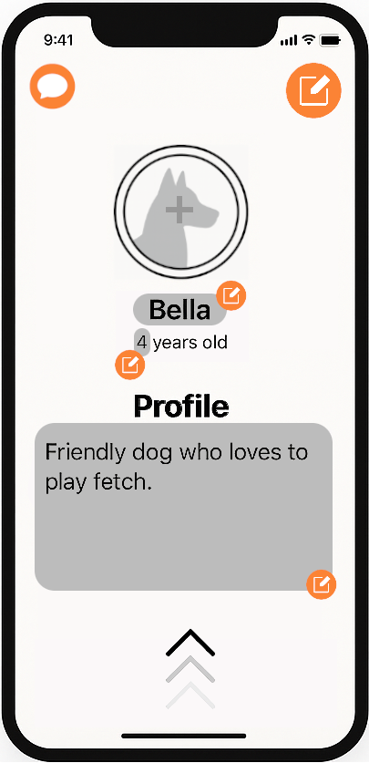
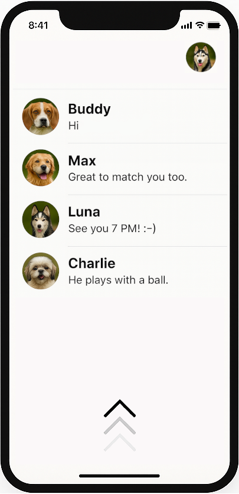
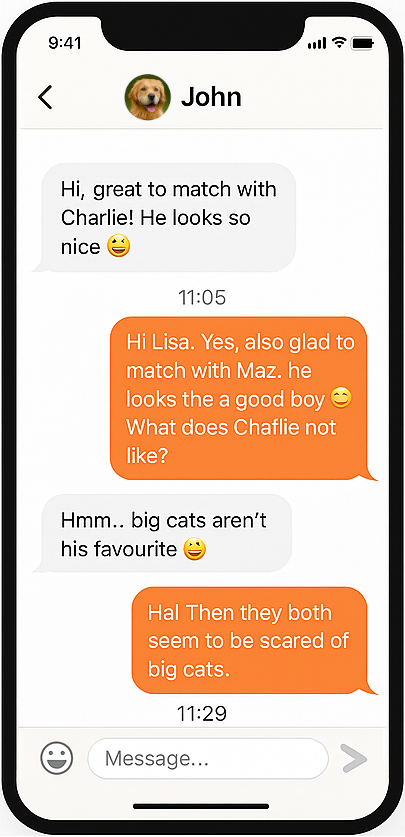

# 🐶 Dog Tinder

**Dog Tinder** is a mobile application built with **Flutter** that helps dog owners meet other pet lovers. Users can create dog profiles, browse others’ pets, swipe to match (like Tinder), and chat with their matches.

---

## 📱 Tech Stack

| Layer | Technology |
|--------|-------------|
| Mobile App | Flutter, Dart |
| Backend API | FastAPI, Python |
| Database | MongoDB |
| Communication | JSON/HTTPS |
| Authentication | Token-based authentication |

---

## 🧩 System Architecture

Below are the diagrams representing the **Dog Tinder** architecture, designed using the **C4 Model**.

### 1️⃣ Context Diagram
Shows the overall context of the system – who uses it and why.



---

### 2️⃣ Container Diagram
Displays the main system containers – the mobile app, API, and database.



---

### 3️⃣ API Components Diagram
Detailed view of the API components within the system.



---

### 4️⃣ Mobile App Components Diagram
Illustrates the mobile app components and their interactions with the API.



---

### 🔹 Legend
Legend explaining the C4 diagram notation.



---

## 🎨 Mockups

The `mockups/` folder contains UI mockups showing the planned user interface design.

Example structure:
```
mockups/
 ├── discover_screen.png
 ├── profile_screen.png
 ├── edit_profile_screen.png
 ├── conversations_screen.png
 ├── chat_screen.png
```

### Discover Screen



---

### Profile Screen



---

### Edit Profile Screen



---

### Conversations Screen



---

### Chat Screen



---

## 🚀 Getting Started

### Backend (FastAPI)
```bash
cd backend
pip install -r requirements.txt
uvicorn main:app --reload
```

### Mobile App (Flutter)
```bash
cd mobile_app
flutter pub get
flutter run
```

---

## 🧠 Features

- 👤 Create and edit user and dog profiles  
- 🔍 Browse other users’ dogs  
- ❤️ Swipe to match  
- 💬 Chat with matches  
- 📸 Upload pet photos  

---

## 📂 Repository Structure

```
dog-tinder/
├── backend/             # FastAPI + MongoDB backend
├── mobile_app/          # Flutter app
├── mockups/             # UI mockups
├── diagrams/            # C4 diagrams
├── README.md
└── requirements.txt
```

---

## 📜 License

This project is licensed under the MIT License.
